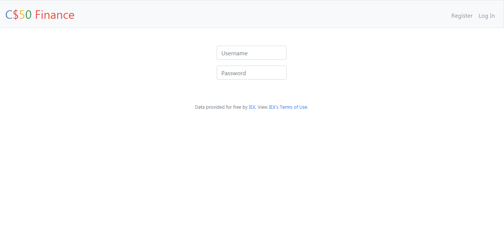
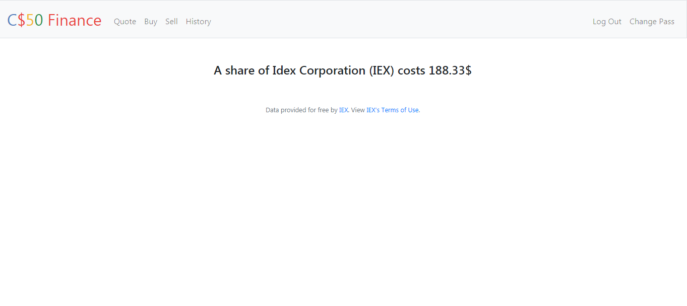
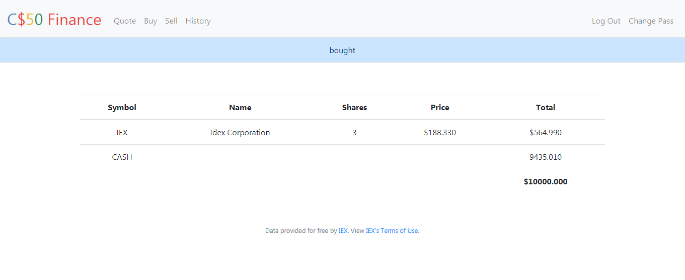
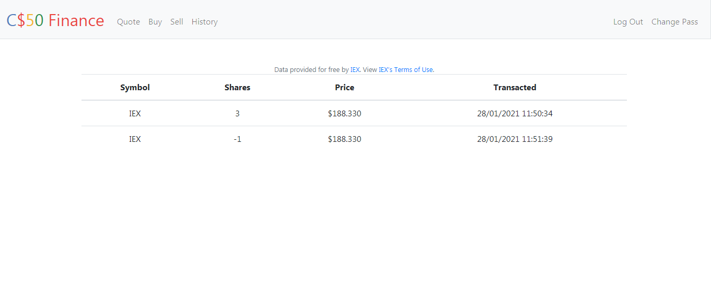

# Finance
I implemented a website via which users can “buy” and “sell” stocks, first you need to register/login   
After logging in you will be able do to numerous things, like checking real stocks actual prices   
you can also see a table which display the stocks you own, number of shares, current price of each stock, and the total value of each holding, it also display you current cash balance, and after buying or selling a stock, you will be redirected to the updated table with a -bought or sold- message depending on the type of action you did before     
theres also a history feature where you are able to see every transaction you made with it details(
stock name-price-shares number-date and time)   
You also can change your own password by implementing your old password, and the new and a confirmation.
I used (Html, Css, Python ,Flask), you need to use cs50 libray to run it , it cant be runned without using it
I think i should make it independent from cs50, it will be better.
